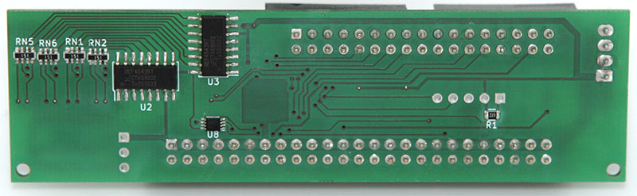

# 8-inch floppy drive - 50-pin to 34-pin adapter Rev. 1

<u>****!! This is the legacy revision 1 of the adapter, stored for reference!
For new projects use the latest version form the [master branch](https://github.com/j-schmidt-eu/8-inch-floppy-50-pin-to-34-pin-adapter/tree/master). !!****</u>

> The 50-pin to 34-pin adapter can be used to adapt 8-inch floppy disk drives (using a 50-pin connector) to be controlled by 3.5-inch and 5.25-inch floppy controllers (using a 34-pin connector).

## Table of Contents
- [Introduction](#Introduction)
- [Specifications](#Specifications)
- [Setup](#Setup)
- [Operation](#Operation)
- [Compatibility](#Compatibility)
- [Two drive setup](#Two-drive-setup)
- [Manufacturing](#Manufacturing)
- [Firmware](#Firmware)
- [FAQ](#FAQ)
- [Licensing](#Licensing)

## Introduction
Many 8-inch floppy drives use a 50-pin card-edge connector to link them to a controller. This is a problem, since modern floppy controllers use a 34-pin IDC connector.
To solve this problem an adapter is necessary that connects compatible signals and generates signals that are unique to the 8-inch floppy drives.
This project aims to provide the schematic, PCB design and firmware source code to build such an adapter.
All compatible signals are directly linked from the 50-pin connector to the 34-pin connector.
Other signals are generated with an onboard microcontroller.

## Specifications
- Power
  - Input voltage: 5V DC
  - Maximum input current: 750mA
  - Connector: 4-pin Berg/Amphenol
- Maximum number of drives per adapter: 1
- Maximum number of adapters per controller: 2
- Pass-through signals:

  | Direction | Name |
  | --------- | ---- |
  | IN        | Index |
  | OUT       | Drive select A |
  | OUT       | Drive select B |
  | OUT       | Direction |
  | OUT       | Step |
  | OUT       | Write data |
  | OUT       | Write gate |
  | IN        | Track 0 |
  | IN        | Write protect |
  | IN        | Read data |
  | OUT       | Side select |
- Generated signals:

  | Direction | Name | Signal source |
  | --------- | ---- | ------------- |
  | OUT       | TG43 (Track greater than 43) / Reduce write current / Filter switch | Determined by tracking the head position. Multiple options available (e.g. control via external signal) |
  | OUT       | Head load | Derived from Motor enable signal. Multiple options available (e.g. control via external signal) |
  | IN        | Ready | Derived from ready or disk change signal. Multiple options available (e.g. control via external signal) |

## Setup
The adapter can drive a single drive. For two drives, two adapters are necessary.
Refer to the [Two drive setup](#Two-drive-setup) section for detailed information on that topic. 

### Floppy drive
A single drive should always be jumpered to be Drive A.
The drive should have the termination resistors enabled/present.

### Connections

#### Data
To connect the controller to the adapter, use a 34-pin ribbon cable (IDC socket connector to IDC socket connector).
It is recommended to connect the adapter after the twist in the ribbon cable. 

_Note: **When using straight cable without twist, your drive will be Drive B on the controller side.**_

The drive should be connected to the adapter with a 50-pin ribbon cable (IDC card edge connector to IDC socket connector).

#### Power
The adapter should be connected to a power supply via the 4 pin Berg/Amphenol connector (only the 5V line will be used). The pinout is ATX compatible.
Power for the floppy drive should be supplied as described in the operations manual for that specific drive.

## Operation
To operate the adapter a single push button (command button) is present on the bottom right corner of the PCB.

_Note: **The button will be disabled when the drive is in use.**_

### Display
For status display and settings, a two-digit seven-segment display is present on the top right corner of the PCB.
A short press on the command button can be used to cycled between the following display modes:

| Mode | Dot status | Description | Range |
| ---- | ---- | ----------- | ----- |
| Track | Left: off Right: on | Current head position | 0 ... 80 |
| Speed | Left: on (positive value) / blink (negative value) Right: off | Percent deviation from nominal rotational speed | -9.9% ... 9.9% |
| Revision | Left: blink Right: blink Alternates between left and right | Software revision number | 1 ... 99 |
| Dark | Left: off Right: off | Disables display | - |

### Settings
To edit the settings of the adapter the setup menu can be entered by pressing the command button for longer than two seconds.
When navigating the setup menu both dots will be lit.
A short press on the command button can be used to cycled between the menu items.
Item value editing can be enabled and disabled by pressing the command button for longer than two seconds.
During editing both dots will blink simultaneously.
A short press on the command button can be used to cycled between value.

To exit the setup menu, navigate to the Exit item and press the command button for longer than two seconds.

The following menu items are available (in listed order):

| Item | Display | Description | Values | Default |
| ---- | ------- | ----------- | ------ | ------- |
| TG43 signal | Left: 1 Right: value | Source for TG43 / reduce write current / filter signal |  1: Active when reading Tracks > 43 2: Active when writing/reading Tracks > 43 3: Active when reading Tracks > 59 4: Active when writing Tracks > 43 or reading Tracks > 59 5: Always active 6: Always inactive 7: From external signal | 0: Active when writing Tracks > 43 |
| Head load signal | Left: 2 Right: value | Source for head load signal | 0: From [motor enable] 1: Always active 2: Always inactive 3: From external signal | 0: From [motor enable] |
| Ready signal | Left: 3 Right: value | Source for ready signal | 0: From [ready] 1: From NOT [disk change] 2: From [ready] AND NOT [disk change] 3: From [ready] OR NOT [disk change] 4: From NOT [ready] 5: From [disk change] 6: From [ready] AND [disk change] 7: From NOT [ready] OR [disk change] 8: Always active 9: Always inactive 10: From external signal | 0: From [ready] |
| Default display mode | Left: 4 Right: value | Default display mode after adapter power up | 0: Track 1: Speed 2: Revision 3: Dark | 0: Track |
| Maximum track number | Left/Right: value | Maximum track number that the connected drive can step to | 32 ... 80 | 76 |
| Exit | Left: 6 Right: dark | - | - | - |

_Note: **The external signal cannot distinguish between multiple signals, therefore it should only be assigned to a single signal.**_

The settings are permanently stored when exiting the setup menu.

## Compatibility
The following list shows some 8-inch floppy drive models and the respective settings that should be correct for them.

| Model | TG43 signal | Head load signal | Ready signal | Maximum track number1 | Tested2 |
| ----- | ----------- | ---------------- | ------------ | -------------------- | ------ |
| Mitsubishi M2896-63 | 0: Active when writing Tracks > 43 4 | 0: From [motor enable] | 0: From [ready] | 76(?) | ❓ |
| NEC FD1165 | 2: Active when writing/reading Tracks > 43 | 0: From [motor enable] | 0: From [ready] | 76(?) | ❓ |
| Shugart SA800 Shugart SA801 | 0: Active when writing Tracks > 43 3 | 0: From [motor enable] 4 | 0: From [ready] | 76(?) | ❓ |
| Shugart SA810 Shugart SA860 | 0: Active when writing Tracks > 43 4 | 0: From [motor enable] 4 | 0: From [ready] | 76(?) | ❓ |
| Shugart SA850 Shugart SA851 | 0: Active when writing Tracks > 43 4 | 0: From [motor enable] 4 | 0: From [ready] | 76(?) | ❓ |
| Tandon TM848-1E Tandon TM848-2E | 0: Active when writing Tracks > 43 4 | 0: From [motor enable] 4 | 0: From [ready] | 76(?) | ❓ |
| Y-E DATA YD-180 | 4: Active when writing Tracks > 43 or reading Tracks > 59 | 0: From [motor enable] 4 | 0: From [ready] | 79 | ✅ |

1 Actual seekable track number; track numbering starts at zero. 
2 ✅: Settings have been successfully tested. ❓: Settings should be correct according to the manual, but haven't been tested yet. 
3 Switching is done internally. 
4 Switching is done internally by default; external switching is available optionally (see manual).

## Two drive setup
When using two drives on a single controller, special precautions must be taken.
A total of two adapters will be required, one for each drive.
Both adapters should be connected to the controller with a single 34-pin ribbon cable.
One adapter should be connected before the twist in the ribbon cable.
And the other adapter should be connected after the twist in the ribbon cable.

__**Important: The adapter connected before the twist in the ribbon cable must have the pins number 26 and 28 removed from the 50-pin box header! Not having these pins removed can damage the floppy controller!**__

Both adapters and both drives should be connected using a single 50-pin ribbon cable.
A single drive should always be jumpered to be Drive A, the other to be Drive B.
The last drive in on the ribbon cable must have the termination resistors enabled/present, the other drive must have the termination resistors disabled/removed.

__**Important: Only one set of termination resistors must be enabled/present! Having more than one termination resistors enabled/present can damage the adapters and the floppy controller!**__

## Manufacturing
The schematics and PCB were designed using [KiCad](https://kicad-pcb.org/). The KiCad project is located in the [Schematics & PCB](Schematics%20&%20PCB) folder. 

### Schematic
[PDF](Schematics%20&%20PCB/50%20pin%20to%2034%20pin%20Floppy%20Adapter/50%20pin%20to%2034%20pin%20Floppy%20Adapter.pdf)

[PNG](Schematics%20&%20PCB/50%20pin%20to%2034%20pin%20Floppy%20Adapter/50%20pin%20to%2034%20pin%20Floppy%20Adapter.png)

### PCB Gerber files
[ZIP](Schematics%20&%20PCB/50%20pin%20to%2034%20pin%20Floppy%20Adapter/pcb.zip)

### PCB manufacturing
The board has a size of 100mm x 28.5mm, a minimum trace distance of 0.2mm and the minimal drill diameter is 0.4mm.
There are two layers and a total of 166 holes to drill. All holes, except for the two mounting holes, are plated.

### Bill of materials
| Reference | Component | Housing / Footprint | Type | Quantity |
| --------- | --------- | ---------------------- | ---- | -------- |
| C1 | Capacitor 100nF 10V | 0402 | Murata GRM155R61A104JA01D5 | 1 |
| C2 | Tantalum Capacitor 10µF 6.3V  | B / EIA-3528-21 | Kemet T491B106K006AT5  | 1 |
| J1 | 34 pin box header | 2 x 17 x 2.54mm | Connfly DS1013-34SSIB1-B-05 | 1 |
| J2 | 4 pin Berg connector | 1 x 4 x 2.54mm | econ connect FK03PN5 | 1 |
| J3 | 50 pin box header | 2 x 25 x 2.54mm | Connfly DS1013-50SSIB1-B-05 | 1 |
| ~~J4~~6 | ~~3 pin header~~ | ~~1 x 3 x 2.54mm~~ | ~~Connfly DS1021-1*3SF1-1~~5 | ~~1~~ |
| J5 | 5 pin socket | 1 x 5 x 2.54mm | Connfly DS1023-1*5S215 | 1 |
| R2 | Resistor 22kOhm 1/8W 5% | 0805 | Vishay CRCW080522K0FKEA5 | 1 |
| R1, R3-R5 | Resistor 1kOhm 1/8W 5% | 0805 | Vishay CRCW08051K00FKEA5 | 4 |
| RN1, RN2, RN5, RN6 | Resistor array 47Ohm 1/16W 5% | 4 x 0603 (1206) convex | Panasonic EXB38V470JV5 | 4 |
| RN3, RN4, RN7, RN8 | Resistor array 100Ohm 1/16W 5% | 4 x 0603 (1206) convex | Panasonic EXB38V101JV5 | 4 |
| SW1 | SMD Push button 6mm x 6mm | 9.5mm x 5.8mm | C&K PTS645SK50SMTR92LFS5 | 1 |
| U1 | PIC18 MCU | QFN-28, 6mm x 6mm, pitch 0.65mm | Microchip PIC18F26K22-I/ML | 1 |
| U2, U3 | BCD to 7-segment decoder | SOP-16, 4.55mm x 10.3mm, pitch 1.27mm | NXP HEF4543B | 2 |
| U4 | Dual buffer | SOT-363 / SC-70-6 | ON Semi NC7WZ16P6X | 1 |
| U5, U6 | Seven segment display | 7mm x 15mm | Kingbright KCSA03-101 | 2 |
| U7 | Single three-state buffer | SOT-353 / SC-70-5 | ON Semi NC7SZ125P5X | 1 |
| U8 | Dual three-state buffer | VSSOP-8, 2.3mm x 2mm, pitch 0.5mm | ON Semi NC7WZ125K8X | 1 |

5 Suggestion; Other types may be used.  
6 Not populated; Pin header may be placed, when needed.

### PCB component placement
When soldering the components to the PCB, it is recommended to place them in the following order:
1. Bottom side, hot air: RN1-RN8, R2, R5, U2, U3, U7, U8
2. Top side, hot air: C1, C2, R1, R3, R4, U4, U1
3. Top side, soldering iron: U5, U6, SW1, J1, J3, J5, J2
4. Do not populate: J4 (place pin header when needed)

## Firmware
The software for the microcontroller was designed in [MPLAB X IDE](https://www.microchip.com/mplab/mplab-x-ide).
It is written in C and compiled with the [MPLAB XC8 compiler](https://www.microchip.com/mplab/compilers).
A programming adapter is required to transfer the firmware into microcontroller. The programming socket J5 is designed to match the pinout of the [MPLAB PICkit 4](https://www.microchip.com/developmenttools/ProductDetails/PG164140) (and older) programmers.
The MPLAB X IDE project is located in the [Firmware](Firmware) folder. 

## FAQ
##### My drive is not listed in the compatibility list, will it work?
>**Check the manual of your drive to see if it needs any additional signals like TG43 and Head load.
If so, check if one of the available options matches the behavior required by the drive. When that is the case, the drive will very likely work.**

##### Can I build and use this for personal, non-commercial purposes?
>**Yes.**

##### Can I build and use this for work in a non-profit organization?
>**[Please contact me.](https://mailhide.io/e/egvcl)**

##### Can I build and use this for work in a commercial setting?
>**[Please contact me.](https://mailhide.io/e/egvcl)**

## Licensing
This project is licensed under the [CC BY-NC-ND 4.0 license](LICENSE).

